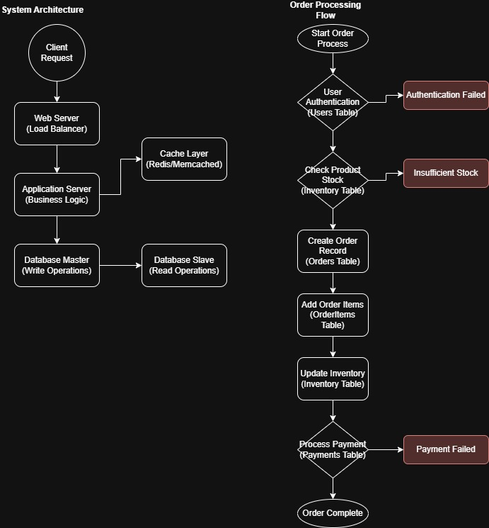

# CHEN Yanshao | Data Science Graduate Student @ Lingnan University

**Positioning**: Aspiring Data Scientist | Generative AI & Agentic RAG Developer
**Tags**: Python | SQL | Gemini API | Agentic RAG | Power BI

---

## 🙋 About Me
I am a Master of Science in Data Science student at Lingnan University with a background in Information Management. I specialize in developing **Agentic RAG** frameworks and modular AI pipelines to solve complex data challenges. With over two years of professional experience as a Management Trainee, I excel at bridging the gap between technical AI capabilities and scalable business solutions.

* **Education**: MSc in Data Science, Lingnan University (Expected Aug 2026)
* **Strengths**: Cross-departmental project leadership, technical documentation, and AI solution development.
* **Focus Areas**: LLM Orchestration, Prompt Engineering, and Automated Data Synthesis.

---

## 🛠 Skills
* **Technical**: Python (Pandas, Numpy, Scikit-learn), SQL, R, Machine Learning, Prompt Engineering.
* **Business**: Cross-functional Project Management, Process Optimization, Technical Documentation, Metric Tracking.
* **Tools**: Google Gemini API, Vertex AI, Power BI, MySQL, MongoDB, Git, AutoCAD.

---

## 🚀 Projects (Portfolio)

### [Project 1] T2P: Term 2 Project - Modular Mathematics Analytics System (Jan 2026 - July 2026)
* **Problem**: Scarcity of high-quality, logically rigorous calculus datasets and structured analytics for tracking higher mathematics mastery.
* **Data**: Synthetic student performance logs and structured JSON datasets containing step-by-step mathematical solutions generated via **Gemini 2.5 Pro**.
* **Approach**: 
    * Built a **multi-agent orchestration** flow in Python to automate educational data synthesis.
    * Developed an **Agentic RAG** architecture and a **Quality Evaluation Module** to ensure pedagogical consistency.
* **Outcome**: Created a reproducible AI pipeline and a functional **Learning Analytics Dashboard** that tracks 15+ topics against an **85% Mastery Target**.
* **Contribution**: **Sole Developer**. Designed the entire system architecture, from prompt engineering to the final data visualization dashboard.

*Fig 1. T2P System Output: Radar chart of Knowledge Mastery and Topic Progression Status.*

### [Project 2] E-commerce SQL vs. NoSQL Performance Study (Oct 2025 - Nov 2025)
* **Problem**: Identifying optimal database architectures for high-concurrency e-commerce scenarios to improve system latency.
* **Data**: Simulated transaction data covering user accounts, products, and inventory, modeled via comprehensive ER diagrams.
* **Approach**: 
    * Designed a **High-Availability System Architecture** featuring a Load Balancer, Cache Layer (Redis), and Master-Slave replication.
    * Developed a detailed **Relational Data Model (ERD)** to manage complex e-commerce entities and transaction flows.
    * Executed benchmarking on **MySQL** and **MongoDB** to compare CRUD performance and complex query handling.
* **Outcome**: Produced a technical report providing data-driven recommendations for database selection based on quantitative performance metrics.
* **Contribution**: Led the experimental design, executed performance stress tests, and created all technical system diagrams and ER models.

  
  

*Fig 2. E-commerce System Architecture and Entity-Relationship Diagram (ERD) designed for performance benchmarking.*

---

## 📄 Contact & Resume
* **Email**: 17796163646@163.com
* **Resume**: [Download My Full CV (PDF)](CHEN Yanshao4.0.pdf)
* **Links**: [GitHub Profile](https://github.com/951135150) | [LinkedIn](https://www.linkedin.com/in/yanshao-chen)