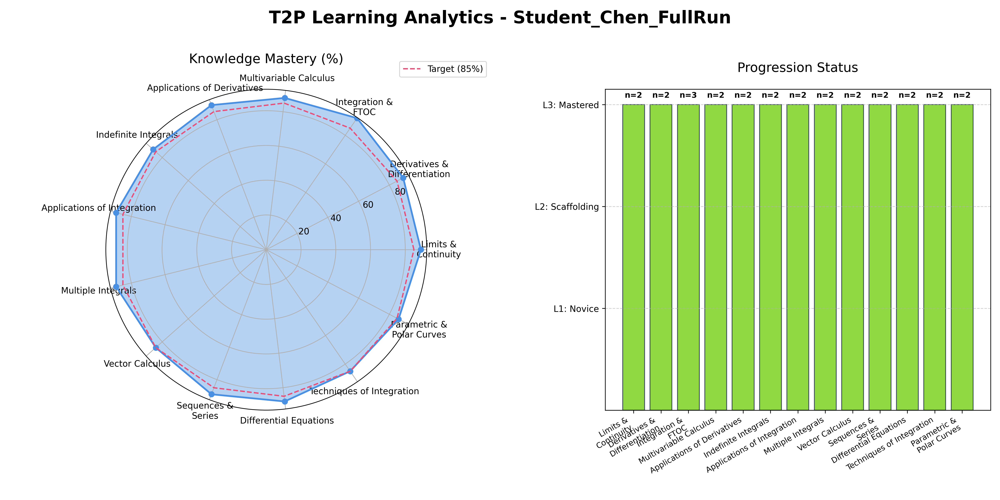

# CHEN Yanshao | Data Science Graduate Student @ Lingnan University

**Positioning**: Aspiring Data Scientist | [cite_start]Generative AI & Agentic RAG Developer [cite: 13, 69]
**Tags**: Python | SQL | Gemini API | Agentic RAG | [cite_start]Power BI [cite: 13, 104]

---

## [cite_start]🙋 About Me [cite: 14-17]
[cite_start]I am a Master of Science in Data Science student at Lingnan University with a background in Information Management [cite: 68-73]. [cite_start]I specialize in developing **Agentic RAG** frameworks and modular AI pipelines to solve complex data challenges [cite: 90-96]. [cite_start]With over two years of professional experience as a Management Trainee, I excel at bridging the gap between technical AI capabilities and scalable business solutions [cite: 76-79].

* [cite_start]**Education**: MSc in Data Science, Lingnan University (Expected Aug 2026) [cite: 68-69]
* [cite_start]**Strengths**: Cross-departmental project leadership, technical documentation, and AI solution development [cite: 77-82].
* [cite_start]**Focus Areas**: LLM Orchestration, Prompt Engineering, and Automated Data Synthesis[cite: 93, 96].

---

## [cite_start]🛠 Skills [cite: 18-21]
* [cite_start]**Technical**: Python (Pandas, Numpy, Scikit-learn), SQL, R, Machine Learning, Prompt Engineering[cite: 19, 104].
* [cite_start]**Business**: Cross-functional Project Management, Process Optimization, Technical Documentation, Metric Tracking [cite: 20, 77-82].
* [cite_start]**Tools**: Google Gemini API, Vertex AI, Power BI, MySQL, MongoDB, Git, AutoCAD [cite: 21, 81, 93, 99-100].

---

## [cite_start]🚀 Projects (Portfolio) [cite: 22-30]

### [cite_start][Project 1] T2P: Term 2 Project - Modular Mathematics Analytics System (Jan 2026 - July 2026) 
* [cite_start]**Problem**: Scarcity of high-quality, logically rigorous calculus datasets and structured analytics for tracking higher mathematics mastery [cite: 90-92].
* [cite_start]**Data**: Synthetic student performance logs and structured JSON datasets containing step-by-step mathematical solutions generated via **Gemini 2.5 Pro** [cite: 93-94].
* **Approach**: 
    * [cite_start]Built a **multi-agent orchestration** flow in Python to automate educational data synthesis[cite: 93, 96].
    * [cite_start]Developed an **Agentic RAG** architecture and a **Quality Evaluation Module** to ensure pedagogical consistency[cite: 95].
    * Integrated a visualization framework to map topic mastery across multiple learning levels.
* **Outcome**: Created a reproducible AI pipeline and a functional **Learning Analytics Dashboard**. The system provides real-time feedback on 15+ topics, tracking mastery against a **target of 85%** and categorizing progression from Novice (L1) to Mastered (L3).
* **Contribution**: **Sole Developer**. [cite_start]Designed the entire system architecture, from prompt engineering and LLM inference to the final data visualization dashboard[cite: 96].

*Fig 1. T2P System Output: Radar chart of Knowledge Mastery vs. 85% Target and Topic Progression Status.*

### [cite_start][Project 2] E-commerce SQL vs. NoSQL Performance Study (Oct 2025 - Nov 2025) [cite: 97]
* [cite_start]**Problem**: Identifying optimal database architectures for high-concurrency e-commerce scenarios to improve system latency [cite: 97-99].
* [cite_start]**Data**: Simulated transaction data and user activity logs modeled via ER diagrams[cite: 100].
* [cite_start]**Approach**: Executed benchmarking on **MySQL** and **MongoDB**, comparing CRUD performance, complex query handling, and transaction latency[cite: 100].
* [cite_start]**Outcome**: Produced a comprehensive technical report providing data-driven recommendations for database selection based on quantitative performance metrics[cite: 101].
* [cite_start]**Contribution**: Led the experimental design, executed performance stress tests, and visualized benchmarking results for technical stakeholders[cite: 101].

---

## [cite_start]📄 Contact & Resume [cite: 31-36]
* [cite_start]**Email**: 17796163646@163.com [cite: 66]
* [cite_start]**Resume**: [Download My Full CV (PDF)](CHEN Yanshao4.0.pdf) [cite: 32]
* **Links**: [GitHub Profile](https://github.com/951135150) | [cite_start][LinkedIn](https://www.linkedin.com/in/yanshao-chen) [cite: 36]